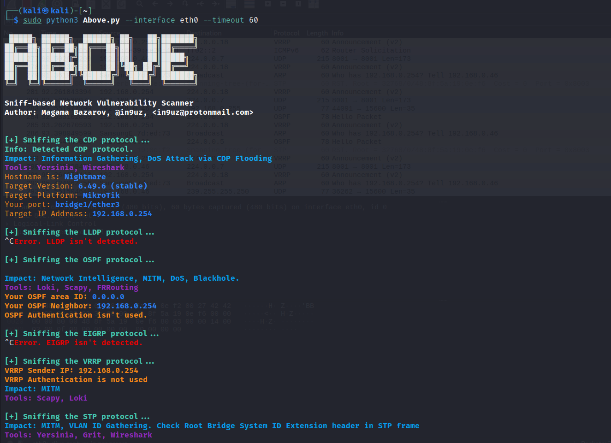

# Above
Sniff-based Network Vulnerability Scanner

This script is based on a sniff of network traffic. At the moment it supports the following protocols:

```
DTP (Dynamic Trunking Protocol)
CDP (Cisco Discovery Protocol)
LLDP (Link Layer Discovery Protocol)
OSPF (Open Shortest Path First)
EIGRP (Enhanced Interior Gateway Routing Protocol)
VRRP (Virtual Router Redundancy Protocol)
STP (Spanning Tree Protocol)
LLMNR (Link Local Multicast Name Resolution)
NBT-NS (NetBIOS Name Service)
```
In Progress:
```
HSRPv1/v2 (Hot Standby Redundancy Protocol)
DHCPv6
```

As input, the scanner takes two arguments:
  - network interface (--interface)
  - Timeout (the amount of time that a packet will be waiting for, according to the filters inside the scanner) (--timeout)
Example:
```
sudo python3 Above.py --interface eth0 --timeout 500
```

After the scanner finishes sniffing a certain protocol, it will display some information about the protocol itself, the impact of the attack and which tool for the attack can be used. Over time, based on your issues, this parameter will improve.
